Exercises 5.1.-5.4.

We will now create a frontend for the blog list backend we created. 
You can use this application from GitHub as the base of your solution. You need to connect your backend with a proxy:

### Proxy

Changes on the frontend have caused it to no longer work in development mode (when started with command npm run dev), as the connection to the backend does not work.

in development mode the frontend is at the address localhost:5173, the requests to the backend go to the wrong address localhost:5173/api/notes. The backend is at localhost:3001.

If the project was created with Vite, this problem is easy to solve. It is enough to add the following declaration to the vite.config.js file of the frontend directory.

```
import { defineConfig } from 'vite'
import react from '@vitejs/plugin-react'

// https://vitejs.dev/config/
export default defineConfig({
  plugins: [react()],

  server: {
    proxy: {
      '/api': {
        target: 'http://localhost:3001',
        changeOrigin: true,
      },
    }
  },
})
```

After restarting, the React development environment will act as proxy. If the React code makes an HTTP request to a path starting with http://localhost:5173/api, the request will be forwarded to the server at http://localhost:3001. Requests to other paths will be handled normally by the development server.

=


5.1: Blog List Frontend, step 1

Create a new vite app


Implement login functionality to the frontend. The token returned with a successful login is saved to the application's state user.

If a user is not logged in, only the login form is visible.
browser showing visible login form only
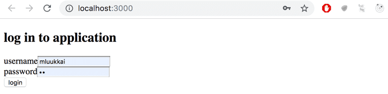
If the user is logged-in, the name of the user and a list of blogs is shown.
browser showing blogs and who is logged in

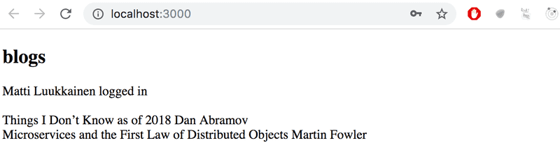

User details of the logged-in user do not have to be saved to the local storage yet.

NB You can implement the conditional rendering of the login form like this for example:

  if (user === null) {
    return (
      <div>
        <h2>Log in to application</h2>
        <form>
          //...
        </form>
      </div>
    )
  }

  return (
    <div>
      <h2>blogs</h2>
      {blogs.map(blog =>
        <Blog key={blog.id} blog={blog} />
      )}
    </div>
  )
}

5.2: Blog List Frontend, step 2

Make the login 'permanent' by using the local storage. Also, implement a way to log out.
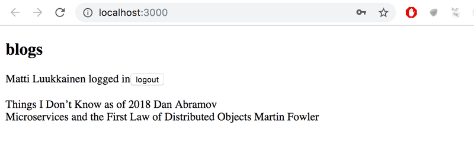
browser showing logout button after logging in

Ensure the browser does not remember the details of the user after logging out.
5.3: Blog List Frontend, step 3

Expand your application to allow a logged-in user to add new blogs:
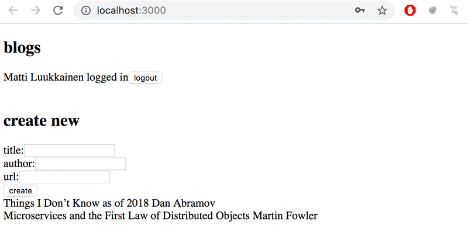
browser showing new blog form


5.4: Blog List Frontend, step 4

Implement notifications that inform the user about successful and unsuccessful operations at the top of the page. For example, when a new blog is added, the following notification can be shown:
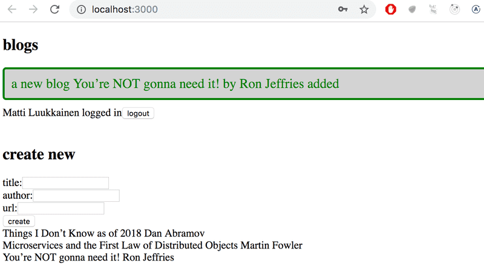
browser showing successful operation notification

Failed login can show the following notification:
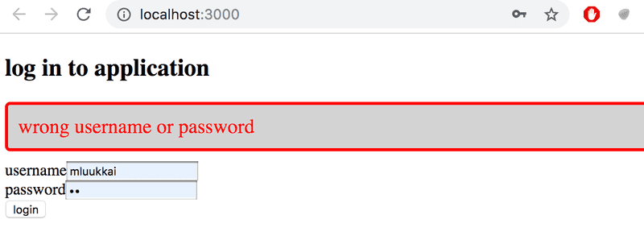
browser showing failed login attempt notification

The notifications must be visible for a few seconds. It is not compulsory to add colors.


5.24: routed blogs, step1

Add React Router to the blogs application so that clicking the links in the navigation bar allows you to control which view is displayed.

At the root of the application, i.e., the path /, a list of all blogs is displayed:
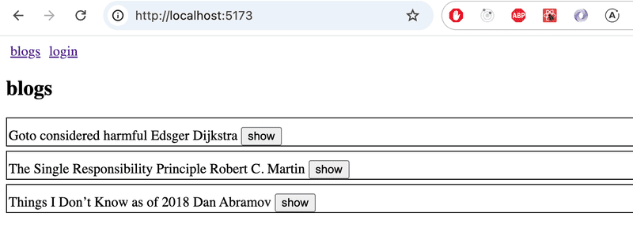

The path /login allows users to log in

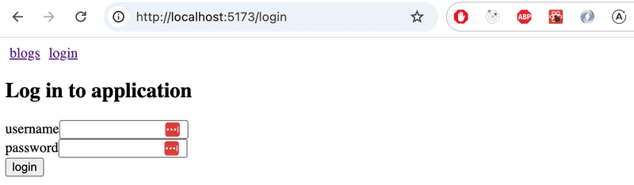

If the user is logged in, a logout button appears in the navigation bar:

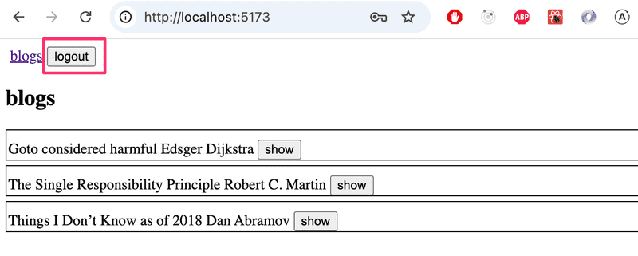

After logging in and out, the user should be directed to the page that lists all blogs.

At this stage, you don’t need to worry about creating blogs yet.
5.25: routed blogs, step2

Implement a view in the application that displays information for a single blog post:

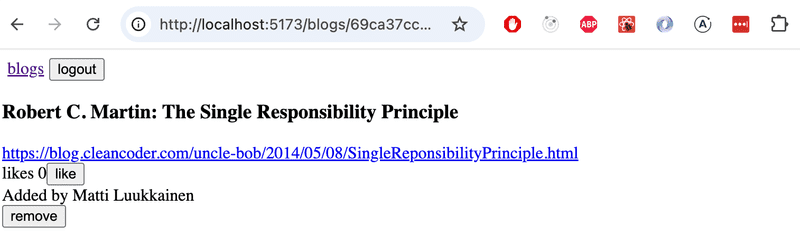

Users navigate to the single blog post view from the blog list:

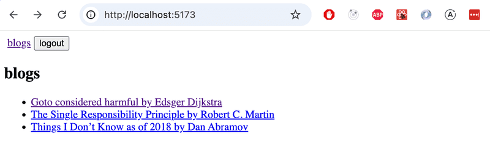


Make sure that the "Like" feature for blogs still works! Also modify the functionality so that only logged-in users can "Like" a blog.
5.27: routed blogs, step3

Create a new view for creating a new blog, which logged-in users can access via the navigation:

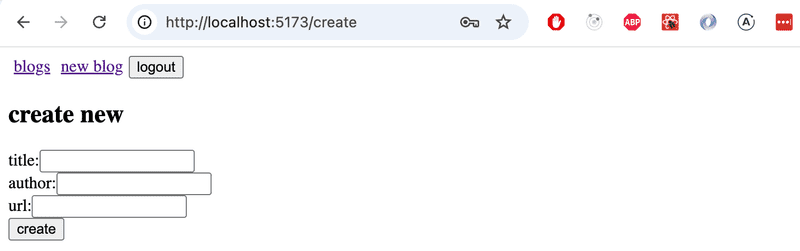


